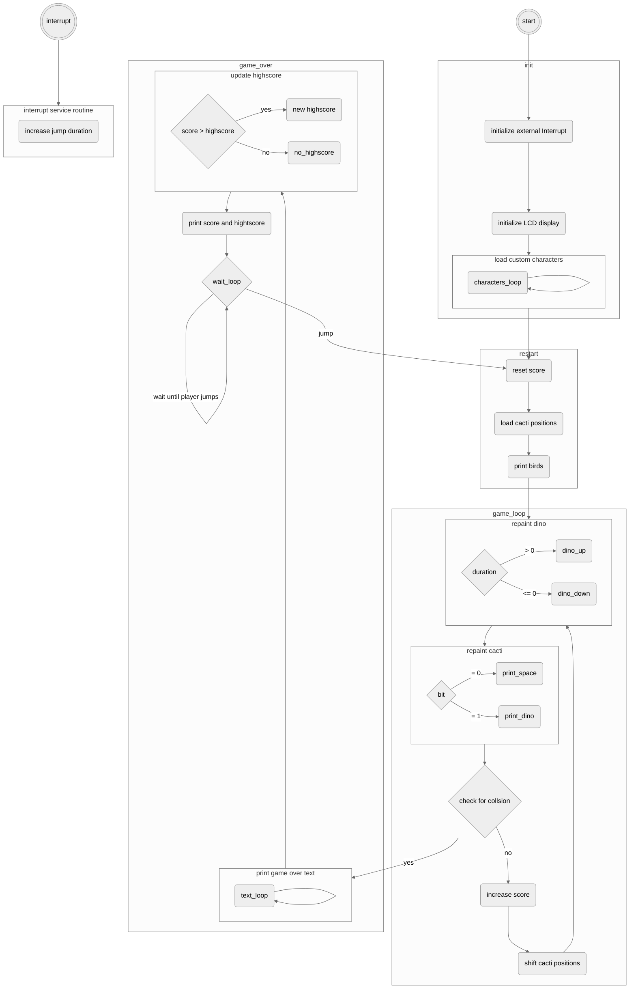

```mermaid
---
config:
    theme: neutral
---
flowchart TD
    start(((start))) --> initInt
    subgraph init
        initInt(initialize external Interrupt) --> initLcd(initialize LCD display)
        initLcd --> customChars
        subgraph customChars [load custom characters]
            characters_loop(characters_loop) --> characters_loop
        end
    end
    customChars --> resetScore
    subgraph restart
        resetScore(reset score) --> loadCacti(load cacti positions)
        loadCacti --> printBirds(print birds)
    end
    printBirds --> repaintDino
    subgraph game_loop
        subgraph repaintDino[repaint dino]
            dinoSpace{duration} -->|> 0|dino_up(dino_up)
            dinoSpace --> |<= 0|dino_down(dino_down)
        end
        repaintDino --> repaintCacti
        subgraph repaintCacti[repaint cacti]
            cactiSpace{bit} -->|= 0|print_space(print_space)
            cactiSpace --> |= 1|print_dino(print_dino)
        end
        repaintCacti --> checkCollision{check for collsion}
        checkCollision --> |no|increaseScore(increase score)
        increaseScore --> shiftCacti(shift cacti positions)
        shiftCacti --> repaintDino
    end
    checkCollision --> |yes|gameOverText
    subgraph game_over
        subgraph gameOverText[print game over text]
            text_loop(text_loop) --> text_loop
        end
        gameOverText --> updateHighscore
        subgraph updateHighscore[update highscore]
            isHighscore{score > highscore} --> |yes|newHighscore(new highscore)
            isHighscore --> |no|no_highscore(no_highscore)
        end
        updateHighscore --> printScore(print score and hightscore)
        printScore --> wait_loop{wait_loop}
        wait_loop -->|wait until player jumps|wait_loop
        wait_loop --> |jump|resetScore
    end
    interrupt(((interrupt))) --> intServiceRoutine
    subgraph intServiceRoutine[interrupt service routine]
        increaseDuration(increase jump duration)
    end

```
